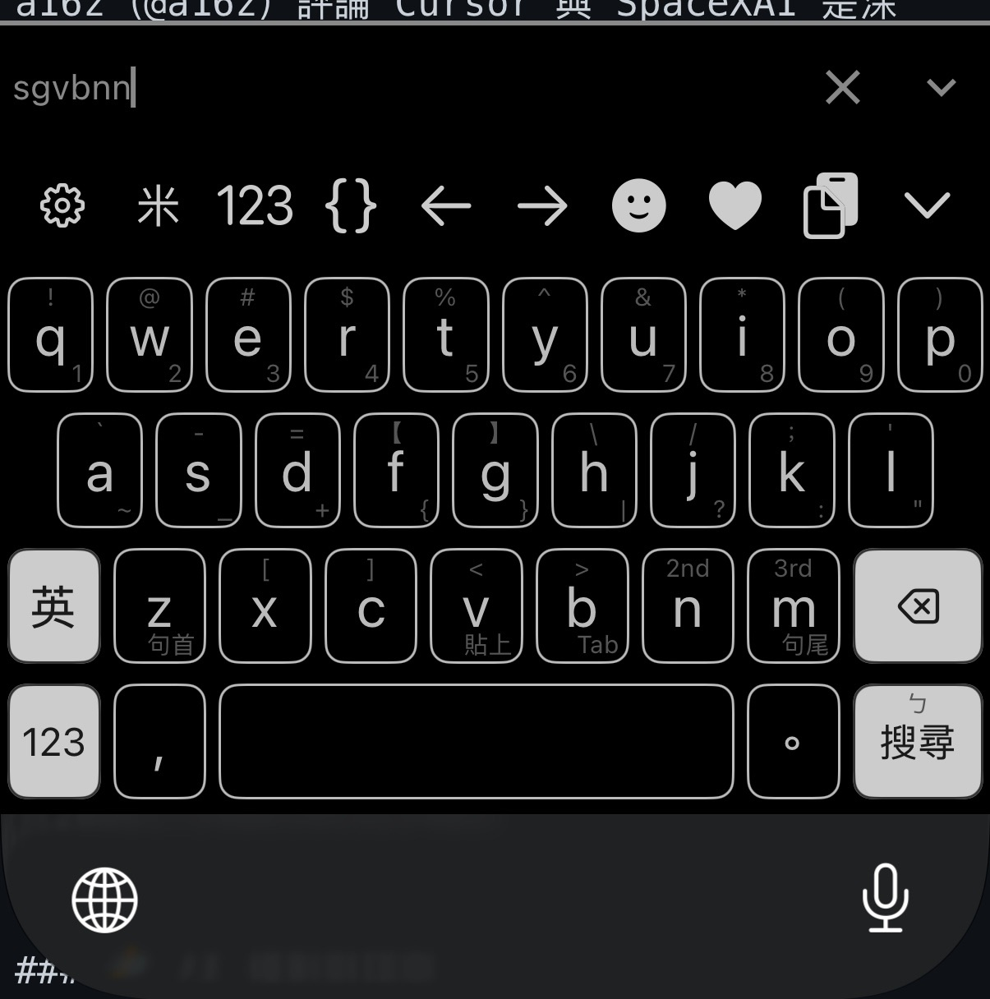

<p align="center">
  
</p>

# OhMyBias 米 iOS

iOS 嘸蝦米（Boshiamy）鍵盤 — [Yabomish](https://github.com/plateaukao/yabomish) 未發布 iOS 實作的極簡抽出版。純 Swift、零依賴。

<p align="center">
  
</p>

## 特色

### 輸入引擎

- **嘸蝦米輸入**：匯入自己的 `liu.cin`，on-device 編譯 mmap 零拷貝載入
- **基本聯想詞**：commit 後即出現詞組聯想（萌典詞組，CC0，僅 687KB）＋自訂詞（user_phrases.txt）
- **字頻學習**：freq.db 依使用習慣排序候選（iCloud 合併）；`,,PIN` 固定同碼字排序
- **`,,` 指令**：`,,T/S/J` 切模式、`,,ZH` 注音查碼、`,,TO` 同音字、`,,PYS/PYT` 拼音查碼、`,,SG` 聯想開關、`,,V/VT/VS` 剪貼簿、`,,H` 說明
- **極簡資料**：不含專業詞典／語料 binary（上游 full 版 98MB → 本版 <2MB）

### 鍵盤介面（以 sweetlime 皮膚為藍本）

- **滑動手勢**：鍵帽角標提示 — 上滑出符號、下滑出數字；`n`/`m` 次選、三選直接上屏；空白上滑切中英、水平拖曳移動游標；Enter 上滑跳注音頁
- **長按選單**：字母大小寫／變音變體、逗號句號長按插入日期時間（中文／民國／日本／英文／農曆／時區等多種格式）
- **工具列與面板**：⚙ 開容器 app 設定、♥ 常用語面板（user_phrases.txt）、符號／Emoji／顏文字分類面板、語言鍵顯示目前模式（米／英）
- **多頁鍵盤**：字母、九宮格數字、半形符號、全形符號、注音查碼
- **主題**：淺色／深色調色盤（含面板深色主題）；可匯入 `.cskin` 皮膚設定（工具列、調色盤、字級、版面選項）
- **記住中英模式**：鍵盤重啟後還原上次輸入模式

## 安裝

1. 用 Xcode 開 `OhMyBias.xcodeproj`，設定 Signing Team，裝到 iPhone
2. 開 OhMyBias app → 匯入 `liu.cin`
3. 設定 → 一般 → 鍵盤 → 鍵盤 → 新增鍵盤 → **OhMyBias 米**
4. （選用）啟用「完整取用權限」以使用 `,,V` 剪貼簿指令

> ⚠️ `liu.cin` 為行易公司版權字表，請自備，本專案不含亦不得散布。

## 開發

```bash
xcodebuild -project OhMyBias.xcodeproj -scheme OhMyBias \
  -destination 'generic/platform=iOS Simulator' build

Tests/run_tests.sh   # 引擎測試（macOS host 執行）
```

## 專案結構

```
Shared/            # 平台無關引擎（抽自 yabomish Sources/Shared，iOS 側實體化）
OhMyBiasKeyboard/  # 鍵盤 extension（UIInputViewController、主題、手勢、面板）
OhMyBiasApp/       # SwiftUI 容器 app（匯入字表、偏好設定、皮膚匯入）
Resources/         # phrases.bin（萌典）、s2t/t2s、zhuyin/pinyin/char_freq、App Icon
Tests/             # 引擎測試（swiftc + check/checkEqual）
```

## 資料來源與授權

| 檔案 | 來源 | 授權 |
|------|------|------|
| `phrases.bin` | [萌典](https://www.moedict.tw/)（教育部國語辭典） | CC0 |
| `zhuyin_data.json` / `pinyin_data.json` / `char_freq.json` | Yabomish 上游整理 | 同上游 |
| `s2t.json` / `t2s.json` | Yabomish 上游整理 | 同上游 |
| 鍵盤版面／符號分類 | Hamster 2 皮膚「蝦米輸入法」（sweetlime.cskin，作者 Ryan）移植 | 見原皮膚 |
